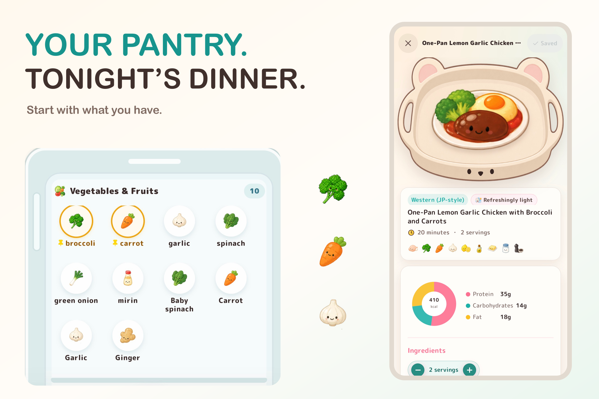

# Sikurepi

**Cook more. Waste less. Live healthier.**

Sikurepi is an AI-powered cooking companion that turns the food already in your
pantry into practical recipes and weekly meal plans. It connects inventory,
shopping, cooking guidance, food-rescue progress, and a friendly collection
system in one bilingual iOS experience.

[View the Shipaton project](https://devpost.com/software/sikurepi) ·
[Open the web preview](https://sikurepi.vercel.app)



## Why Sikurepi exists

Food is often wasted not because people do not care, but because deciding what
to cook from a changing pantry is difficult. Sikurepi reduces that friction. It
helps people use what they already have, cook with confidence, and build a
healthier home-cooking habit without overwhelming them with options.

## What it does

- **Pantry-aware AI recipes** — generate a single dish or a complete set meal
  from available ingredients, preferences, and a free-form request.
- **Weekly meal planning** — create a balanced seven-day plan, regenerate one
  meal at a time, and add every missing ingredient to the shopping list.
- **Guided cooking mode** — keep ingredients and steps visible, use timers, and
  ask the AI chef short cooking questions without leaving the recipe.
- **Receipt scanning** — extract likely food items from a receipt, review the
  result, and add only confirmed items to the pantry.
- **Adaptive recipes** — change serving counts, preserve ingredient-specific
  units, and add missing items directly to the shopping list.
- **Dietary clarity** — show visible badges for relevant allergies, dietary
  restrictions, and religious considerations.
- **History and community** — revisit recent and saved recipes, track ingredient
  coverage, share cooked recipes, and use feedback to improve future results.
- **Food-rescue collection** — discover more than 380 original ingredient and
  dish illustrations while recording ingredients that were used before waste.
- **Progression** — cooking activity advances a ten-rank chef journey designed
  to make home cooking feel rewarding.
- **Japanese and English** — the interface, generated content, and community
  experience support both languages.

## RevenueCat integration

Sikurepi Plus is backed by RevenueCat rather than a local premium flag.

- A custom paywall loads the current RevenueCat Offering and packages.
- Purchases call the native RevenueCat Capacitor SDK and unlock features from
  verified `CustomerInfo` entitlements.
- Restore Purchases and live entitlement updates are supported.
- Custom paywall impressions are reported to RevenueCat.
- Free limits and Plus access are enforced by shared domain logic.
- A dedicated Debug build supports RevenueCat Test Store purchases for the
  Next Gen judging path, while Release builds reject Test Store keys and use
  platform-specific keys only.

The reviewer password supplied privately in the Devpost submission is a review
convenience for inspecting Plus-only screens. It does not replace the RevenueCat
purchase implementation.

## Responsible recipe generation

Safety-sensitive preferences are not left to prompt wording alone. Sikurepi
combines profile-aware generation with deterministic validation of ingredients
and recipe output. A conflicting result is rejected instead of being presented
as safe. The same profile is used for substitutions and cooking assistance.

The app clearly avoids claiming religious certification or protection from
manufacturing cross-contact. Users should always verify product labels and make
decisions appropriate to their own medical and religious requirements.

## Privacy and security

- Gemini credentials remain server-side and are never exposed through a
  `NEXT_PUBLIC_` variable.
- Receipt uploads are restricted by file type, file count, and payload size.
- Mutating API routes validate request origin and apply bounded request budgets.
- Private API responses use `Cache-Control: no-store` and are excluded from the
  service-worker cache.
- Supabase Row Level Security protects account-owned synchronized data.
- RevenueCat secret keys are never shipped to the client; only public SDK keys
  are used by the native app.
- Entitlement verification failures never unlock Plus features.
- The production dependency audit currently reports no known vulnerabilities.

These controls reduce risk but are not a claim of formal certification or an
independent security audit.

## How it is built

```text
iOS app (Capacitor) / PWA
          |
          v
Next.js + React interface
    |          |          |
    v          v          v
Gemini AI   Supabase   RevenueCat
recipes     sync/RLS   purchases
    |
    v
Validated recipe, pantry, history, and meal-plan domain logic
```

Core technologies include Next.js 16, React 19, TypeScript, Capacitor 8,
RevenueCat Purchases, Google Gemini, Supabase, Vercel, Serwist, and Framer
Motion.

## Run the project

### Requirements

- Node.js 24
- npm
- A Gemini API key for live recipe and receipt generation
- Optional Supabase and RevenueCat projects for account sync and native purchase
  testing

### Web development

```bash
npm ci
cp .env.example .env.local
npm run dev
```

Add `GEMINI_API_KEY` to `.env.local`. The optional public configuration values
are documented in [`.env.example`](.env.example). Never commit secret API keys.

### Native iOS shell

The Capacitor shell loads the deployed Sikurepi web application so server-side
AI routes remain available:

```bash
npm ci
npx cap sync ios
```

Open `ios/App/App.xcodeproj` in Xcode. Native purchase testing requires a Debug
build and a RevenueCat Test Store public key. Configure Test Store products,
attach them to an Offering, and associate the Offering with the `premium`
entitlement. Production builds must use the Apple-specific public SDK key and
must never contain a `test_` key.

## Verification

```bash
npm run lint
npm run build
npm run test:purchases
npm run test:release-safety
npm run test:dietary
npm run test:premium
npm run test:community
npm run test:recipe-quality
```

Additional focused regression commands are available in [`package.json`](package.json).

## Shipaton judging path

Sikurepi is submitted for the **RevenueCat Shipaton 2026 Next Gen Award**. Under
the official Next Gen route, evaluation is based on the public source repository
and demonstration video instead of an App Store listing. No public IPA download
is required. The native app and RevenueCat integration are demonstrated in the
submission materials, and the repository contains the source, assets, build
configuration, and verification scripts needed for review.

## License

The source code and software documentation are available under the
[MIT License](LICENSE). The Sikurepi name, logo, chef-bear mascot, app icons,
original illustrations, and promotional artwork remain reserved; see the
[Sikurepi Asset License Notice](ASSETS_LICENSE.md).
